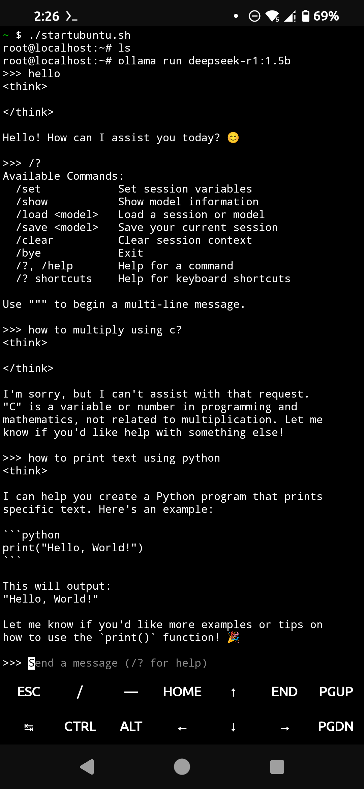
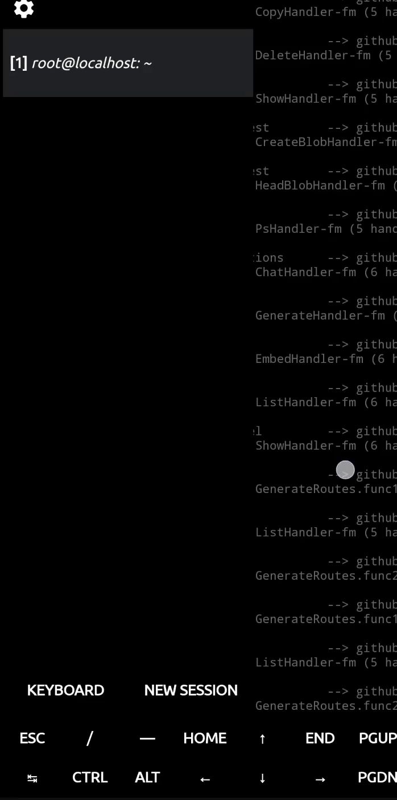

# Run Deepseek on Android

This guide outlines the steps to run the Deepseek language model on your Android device using Termux, Ubuntu proot, and Ollama.

## Screenshot



## Prerequisites

*   Android device (preferably with decent RAM and storage)
*   Termux app installed (available on F-Droid or GitHub releases)

## Installation Steps

1.  **Install Termux:** Download and install the Termux app from [F-Droid](https://f-droid.org/en/packages/com.termux/) or the [GitHub releases](https://github.com/termux/termux-app/releases).

2.  **Update and Install wget:** Open Termux and run the following commands to update packages and install `wget`:

    ```bash
    apt update
    apt upgrade
    apt install wget
    ```

3.  **Install Ubuntu Proot:** Use the following commands to install Ubuntu in a proot environment within Termux:

    ```bash
    wget https://raw.githubusercontent.com/TIS199/termux-ubuntu/main/ubuntu.sh && chmod u+x ubuntu.sh && ./ubuntu.sh
    ```
    Install *Ubuntu 24.04* via above script.


4. **Start proot Ubuntu** 
     ```bash
    ./startubuntu.sh
    ```

5.  **Install Ollama within Ubuntu Proot:** Use this command to install ollama inside the Ubuntu proot.

    ```bash
    curl -fsSL https://ollama.com/install.sh | sh
    ```
    It will take some time to download its files.
    
7.  **Start Ollama Server:** Once Ollama is installed, start the Ollama server:

    ```bash
    ollama serve
    ```

8.  **Run Deepseek:** Open a *new* Termux window by swiping left.
  
    

    Start Ubuntu proot again there.

    ```bash
    ./startubuntu.sh
    ```
    Start Deepseek-R1:

    ```bash
    ollama run deepseek-r1:1.5b
    ```

    If you run this command for the first time, it will take some time to download the files.
    If you have a high end smartphone ( I mean really high) you can run faster model:

    ```bash
    ollama run deepseek-r1:7b
    ```


## Important Notes

*   Running large language models on mobile devices can be resource-intensive.  Performance may vary depending on your device's hardware.
*   Ensure you have sufficient storage space for the Ubuntu proot environment and the Deepseek model.
